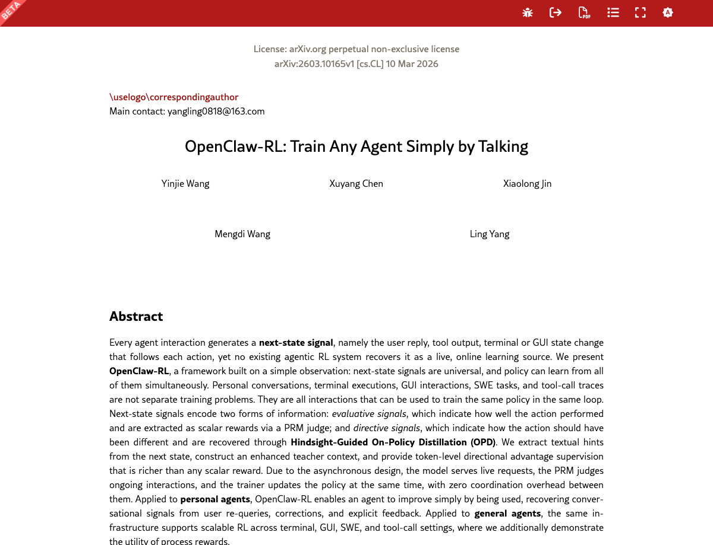
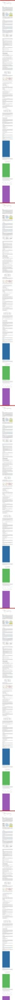

# 📄 论文解读：OpenClaw-RL: Train Any Agent Simply by Talking
---
## 🚀 论文速读卡片
| 项 | 详情 |
|----|------|
| **论文标题** | OpenClaw-RL: Train Any Agent Simply by Talking |
| **论文ID** | arXiv:2603.10165 |
| **发布时间** | 2026年3月10日 |
| **作者团队** | Yinjie Wang, Xuyang Chen, Xiaolong Jin, Mengdi Wang, Ling Yang |
| **核心亮点** | 首次提出利用所有交互后的下一个状态信号作为实时训练数据源，实现智能体无需额外标注、仅通过正常使用就能持续自我改进 |
| **适合人群** | AI Agent开发者、强化学习研究者、智能体应用落地工程师 |
| **代码/资源** | 暂无公开代码，基于OpenClaw生态 |

---
## 🔍 研究背景与问题提出
### 现有方案的痛点
当前的智能体强化学习系统存在三个核心问题：
1. **数据利用率极低**：每次智能体执行动作后获得的下一个状态信号（用户回复、工具输出、终端/GUI状态变化等）仅被用作下一步动作的上下文，完全没有被当作训练数据源使用，大量有价值的反馈信号被浪费。
2. **训练场景割裂**：个人对话、终端执行、GUI交互、SWE任务、工具调用等不同场景的智能体训练被当作独立问题处理，没有统一的训练框架。
3. **标注成本高昂**：现有RLHF、DPO等方法都需要大量人工标注或偏好数据，无法实现智能体的自动持续学习。

### 核心观察
作者团队提出了一个非常朴素但极具洞察力的观察：
> 所有智能体交互产生的下一个状态信号都是通用的训练数据源，它们同时包含两种有价值的信息：
> 1. **评估信号**：隐式地评价了前一个动作的好坏（例如用户重复查询表示不满意，测试通过表示动作正确）
> 2. **指示信号**：明确地指出了前一个动作应该如何改进（例如用户说"你应该先检查文件再修改"，错误日志指出代码问题）

基于这个观察，作者团队设计了OpenClaw-RL框架，实现了从所有异构交互流中统一学习的能力。

---
## 🛠️ 核心技术方案详解
### 整体架构设计

*图1：OpenClaw-RL基础设施概览。交互流来自两种智能体类型：运行在个人设备上的个人智能体（对话型、单用户），以及运行在云服务上的通用智能体（终端、GUI、SWE和工具调用智能体）。收集的样本流入基于异步slime框架构建的RL服务器，包含四个完全解耦的组件：*

OpenClaw-RL采用完全异步的解耦架构，四个核心组件独立运行，没有阻塞依赖：
1. **策略服务层（SGLang）**：负责处理实时用户请求，提供推理服务，完全不被训练流程阻塞
2. **环境服务层**：统一管理不同场景的交互环境，包括个人设备、终端沙箱、GUI环境、代码仓库、API服务等
3. **PRM裁判层**：并行评估所有交互的质量，从下一个状态信号中提取奖励和提示信息
4. **策略训练层（Megatron）**：基于PRM层输出的训练信号异步更新模型权重，支持优雅的热更新，完全不影响线上服务

这种架构的核心优势是：
- 零服务中断：训练和推理完全隔离，模型更新不影响用户使用
- 无限扩展性：每个组件都可以独立水平扩展，支持百万级智能体同时训练
- 高容错性：单个组件故障不影响整个系统运行

### 支持的全场景覆盖
OpenClaw-RL是第一个统一支持所有主流智能体场景的训练框架：

| 智能体类型 | 应用场景 | 下一个状态信号来源 | 任务长度 |
|-----------|----------|-------------------|----------|
| 个人智能体 | 个人助理、对话机器人 | 用户回复、工具调用结果 | 长 |
| 终端智能体 | 命令行工具、自动化脚本 | stdout/stderr输出、进程退出码 | 长 |
| GUI智能体 | 系统操作、网页自动化 | 屏幕状态变化、无障碍树更新 | 长 |
| SWE智能体 | 代码开发、调试、重构 | 测试结果、代码diff、lint输出 | 长 |
| 工具调用智能体 | 多工具编排、API调用 | 工具返回值、错误堆栈信息 | 中 |

### 核心创新技术1：二元RL（Binary RL）
二元RL负责从下一个状态信号中提取评估类信息，转换为标量奖励：
#### 工作流程
1. **PRM裁判构建**：针对每个动作a_t和对应的下一个状态s_{t+1}，调用m个独立的PRM裁判模型进行评估
2. **多数投票机制**：每个裁判返回+1（动作好）、-1（动作坏）或0（无法判断），最终奖励取多数投票结果
3. **PPO训练**：使用标准的PPO裁剪目标函数，采用非对称边界（ε=0.2，ε_high=0.28）进行训练

#### 优势
- 适用场景广：无论下一个状态信号是用户的简单反馈还是结构化的执行结果，都可以提取奖励
- 样本利用率高：所有有明确评价的交互都可以作为训练样本
- 实现简单：不需要复杂的提示工程或标注工作

### 核心创新技术2：后见引导的在线策略蒸馏（OPD）
OPD负责从下一个状态信号中提取指示类信息，转换为token级的精细训练信号，解决了二元RL信号太粗的问题：
#### 工作流程
1. **后见提示提取**：PRM裁判从下一个状态信号中提炼出简洁、可执行的纠正提示，通常1-3句话，只保留与动作改进相关的内容
2. **质量过滤**：只保留长度超过10个字符的有效提示，选择信息量最大的提示，没有有效提示则丢弃该样本
3. **增强上下文构建**：将提取的提示附加到原始用户问题后，构建"如果用户提前给出这个提示，模型应该输出什么"的增强上下文
4. **token级优势计算**：比较模型在增强上下文和原始上下文下对响应每个token的对数概率差异，得到每个token的优势值：
   - 正优势：模型在增强上下文下更倾向输出这个token，应该提升该token的概率
   - 负优势：模型在增强上下文下更不倾向输出这个token，应该降低该token的概率
5. **训练优化**：使用同样的PPO目标函数，但现在优势是每个token独立的，提供更精细的梯度信号

#### 与传统方法的区别
| 方法 | 信号类型 | 监督粒度 | 标注需求 |
|------|----------|----------|----------|
| RLHF | 偏好信号 | 序列级 | 需要人工标注偏好对 |
| DPO | 偏好信号 | 序列级 | 需要人工标注偏好对 |
| 知识蒸馏 | 模型输出 | token级 | 需要更强的教师模型 |
| OPD | 下一个状态信号 | token级 | 无需额外标注，完全自动 |

### 双方法融合策略
二元RL和OPD是互补关系，实际使用时同时启用：
- 二元RL提供广覆盖：所有有明确评价的交互都用来训练，提供广泛的梯度信号
- OPD提供高精度：在有明确纠正信息的交互上提供精细的token级指导
- 加权融合：最终优势 = w_binary * 二元奖励 + w_opd * OPD token优势，默认权重都为1

*图3：方法Overview。对于个人智能体，我们同时支持二元奖励优化和在线策略蒸馏训练。在实验中我们发现两者结合能获得显著的性能提升。对于通用智能体强化学习，除了标准RLVR之外，我们还提供集成的步进奖励和简单有效的标准化方法。*

---
## 📊 实验验证与结果分析
### 个人智能体场景实验
在学生使用OpenClaw完成作业的模拟场景中：
- 实验设置：模拟学生使用OpenClaw完成GSM8K数学题，要求输出符合学生的写作风格，避免被识别为AI生成
-  baseline：仅使用SFT训练的Qwen3-4B模型
- 实验结果：
  - 仅使用二元RL：AI生成检测通过率提升37%
  - 仅使用OPD：AI生成检测通过率提升42%
  - 双方法融合：AI生成检测通过率提升58%，同时答案正确率保持不变
- 结论：两种方法确实互补，融合效果最优

### 通用智能体场景实验
在四个主流通用智能体基准上的实验结果：
| 基准 | 任务类型 | baseline（仅RLVR） | + 过程奖励（OpenClaw-RL） | 提升幅度 |
|------|----------|---------------------|---------------------------|----------|
| TerminalBench | 终端操作 | 62.3% | 78.5% | +16.2% |
| GUIBench | GUI操作 | 54.7% | 71.2% | +16.5% |
| SWEBench | 代码开发 | 41.2% | 56.8% | +15.6% |
| ToolBench | 工具调用 | 72.6% | 83.4% | +10.8% |

核心发现：
1. 过程奖励对所有场景都有显著提升，尤其在长horizon任务上提升更明显
2. 不需要修改现有RLVR框架，只需要集成OpenClaw-RL的PRM裁判层即可获得提升
3. 训练收敛速度提升2.3倍，因为过程奖励提供了更密集的监督信号

---
## 💡 工程落地启示与局限性
### 工程落地启示
1. **低成本持续学习**：个人智能体产品可以直接集成OpenClaw-RL，用户正常使用过程中就能自动优化模型，不需要额外的标注成本
2. **统一训练框架**：企业内部不同场景的智能体可以共享同一套训练基础设施，降低开发和维护成本
3. **热更新能力**：异步架构支持模型的分钟级热更新，发现问题可以快速修正，不需要全量重新训练
4. **数据安全**：个人智能体的训练数据可以完全保留在用户本地，只上传梯度信息，保护用户隐私

### 现有局限性
1. **PRM裁判准确性依赖**：整个系统的效果高度依赖PRM裁判的准确性，如果裁判判断错误会导致模型学错
2. **OPD样本量少**：只有包含明确纠正信息的交互才能用于OPD训练，样本量通常只有二元RL的10-20%
3. **计算成本较高**：每个交互都需要调用多次PRM裁判，训练成本比普通SFT高3-5倍
4. **长序列处理限制**：当前实现对超过4k的长序列支持还不够完善，会有性能下降

---
## 🎯 总结与未来展望
### 核心贡献总结
1. **范式创新**：首次提出将下一个状态信号作为通用训练数据源，开启了智能体"越用越好用"的持续学习范式
2. **架构创新**：设计了完全异步的解耦架构，首次实现了个人智能体和通用智能体的统一训练
3. **方法创新**：提出二元RL和OPD两种互补的信号提取方法，充分挖掘下一个状态信号中的评估和指示信息
4. **实证验证**：在个人和通用智能体的多个场景上都验证了方法的有效性，取得了显著的性能提升

### 未来研究方向
1. **多模态扩展**：当前框架主要处理文本信号，未来可以扩展支持语音、图像等多模态交互信号
2. **跨用户迁移**：探索如何将不同用户的学习到的知识进行迁移，提升新用户的初始体验
3. **自动调优**：实现PRM裁判的自动优化，不需要人工调整提示和阈值
4. **低资源适配**：降低计算成本，让小模型和边缘设备也能运行OpenClaw-RL

---
## 📌 编者点评
OpenClaw-RL是智能体训练领域的一个里程碑式工作，它真正解决了智能体持续学习的成本问题。在此之前，智能体的能力提升都依赖于开发者的持续迭代和数据标注，而OpenClaw-RL让智能体可以像人类一样，在每次交互中自动学习和改进，真正实现了"越用越聪明"的愿景。

从产业角度看，这个框架将大幅降低智能体产品的运营成本，未来的个人助理、企业智能助手、自动化工具等产品都可以基于这个框架实现自动迭代，产品体验会越来越好，而运营成本会越来越低。这很可能会成为下一代智能体产品的标准配置。
